# CanPlan Mobile

A cross-platform iOS/Android app that guides people with cognitive disabilities
through daily routines **one step at a time** — with photos, video, audio, and
text-to-speech on every step — while their caregivers schedule tasks and follow
progress from the same app.

Built with **React Native + TypeScript + Expo**, backed by **AWS AppSync
(GraphQL)**, **Cognito**, and **S3**.

---

## Team & my contributions

This was a **4-person team project** (Northeastern CS7980 capstone, June–August
2026). This repository is my copy of the team codebase.

| Contributor | Main areas |
| --- | --- |
| **[@Joeyjiang0217](https://github.com/Joeyjiang0217)** (me) | Calendar & scheduling, task/step authoring, step player, notifications, settings, media caching, test suite |
| [@Michael-Alz](https://github.com/Michael-Alz) | Initial GraphQL/Amplify/Cognito client, auth & email verification, categories |
| [@usaycurry](https://github.com/usaycurry) | Caregiver portal (linked-patient dashboard, delegated task authoring) |
| [@jmpei](https://github.com/jmpei) | Progress reports, AI-assisted step generation |

**What I built** (65% of commits, ~18K of the 27K lines of TypeScript surviving
at HEAD):

- **The calendar and recurring-assignment system** — RRULE-backed scheduling,
  the occurrence lifecycle (`TO_DO → IN_PROGRESS → COMPLETED / SKIPPED`, plus an
  `OVERDUE` derivation), day pager, month picker with photo thumbnails,
  hour-slot grouping, collapsible overdue history, pull-to-refresh
- **The task and step authoring flow** — create/edit tasks, attach photo, video,
  audio and text to each step, drag-to-reorder with optimistic cache updates,
  multi-select, move between categories
- **The step player** — swipeable step-by-step execution, check-driven
  completion with optimistic updates and rollback, server-side step timing,
  text-to-speech read-aloud
- **Local notifications** — a rolling 14-day reminder scheduler with debounced
  resync and cold-start deep links
- **Settings & persistence** — interface settings, audio/speech settings,
  notification preferences, Simple Mode boot routing
- **On-device media cache** — derived thumbnails, request de-duplication
- **The entire test suite** — 113 Jest unit tests + CI type-check gating

---

## Screens

The app has **30 screens**. Below is a walkthrough of the main flows.

> **Note:** the screenshots below are from a development build with test data.

### Auth

`SignIn` · `CreateAccount` · `VerifyEmail` · `ForgotPassword` · `ForgotPasswordReset`

Email/password sign-in through **Amazon Cognito**, with email verification and
password reset. The app boots into one of three navigation stacks — Auth,
Onboarding, or Main — chosen purely from session + profile state, so a user
never sees a screen that doesn't match their sign-in state.

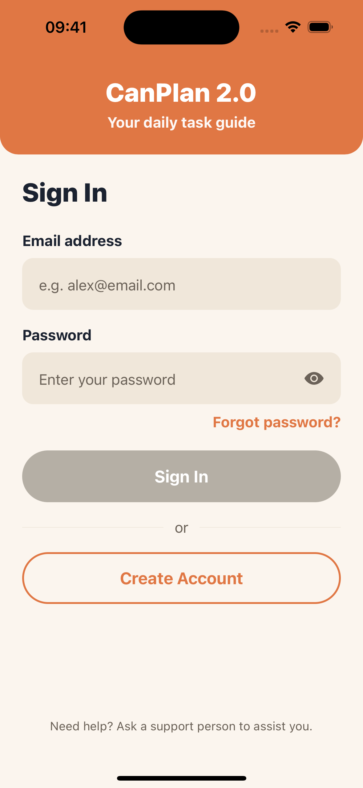 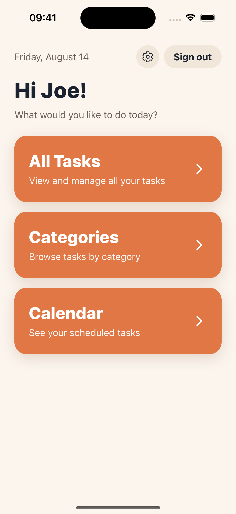

### Home & Calendar

`Home` · `Calendar` · `AllTasks` · `Categories`

The calendar is the core of the app. Each day shows the user's scheduled
occurrences grouped into hour slots, with a cover photo, a status pill, and a
`steps completed / total` count. A footer summarizes the day: Overdue, To Do,
Done, Skipped.

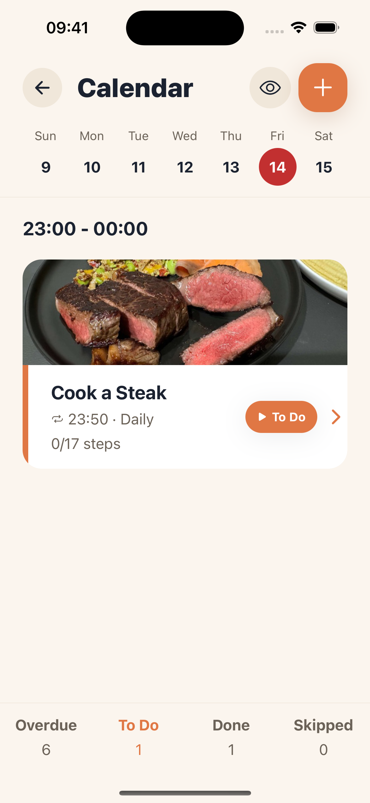 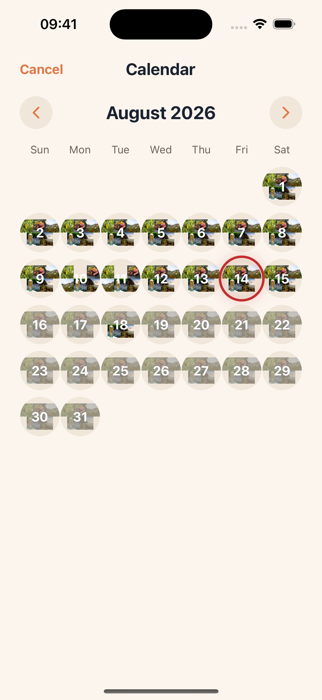

The month view builds each day's circle from thumbnails of that day's task
photos, generated and cached on device.

Recurring tasks store only an RRULE, so future occurrences are *virtual* until
the user interacts with them. The calendar computes a three-state lifecycle
(`active` / `settled` / `projected`) over a 30-day look-ahead, which drives both
the colour treatment and what delete options each occurrence offers
("this one" vs. "this and all future").

### Creating a task

`CreateTask` · `CreateTaskStep` · `ReorderSteps` · `TaskDetail` · `ManageTasks`

A task is a reusable template made of ordered steps. Templates live in a library
that doubles as the picker used when scheduling.

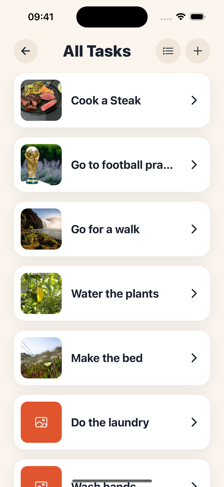 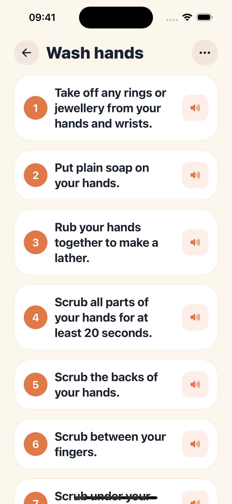

Each step can carry a photo, a video, an audio clip, and a description — or just
text, as above. Steps are reordered by drag and drop, with the reordered pages
written straight into the TanStack Query cache so the list never flickers back
while the write is in flight.

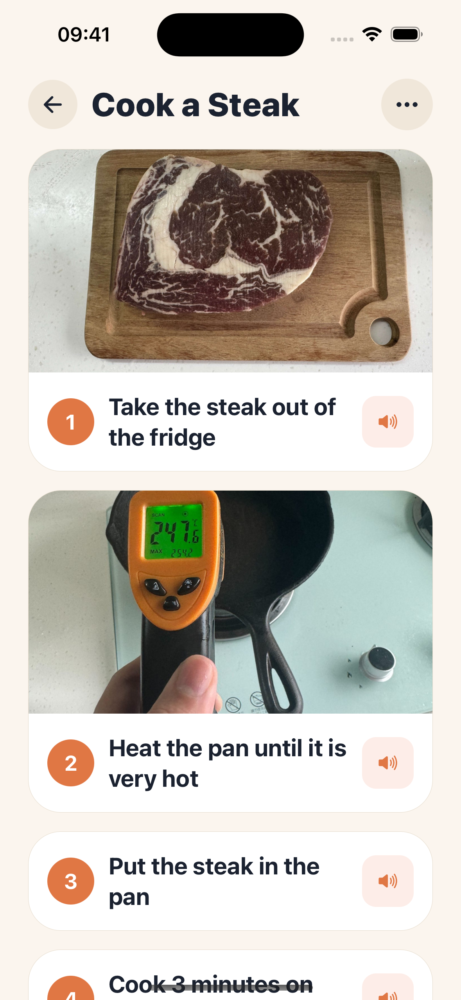

Renaming a task whose steps were AI-generated surfaces a prompt offering to
regenerate them for the new name, with a one-tap undo back to the old name.

### Scheduling

`SelectTask` · `ScheduleAssignment`

A template is scheduled onto the calendar as a one-off or repeating assignment.
Repeating assignments are stored as an RRULE and expanded into concrete
occurrences by the backend feed. Ten repeat presets sit in front of the rule
syntax, so "Weekdays" is what the user picks and
`FREQ=WEEKLY;BYDAY=MO,TU,WE,TH,FR` is what gets stored.

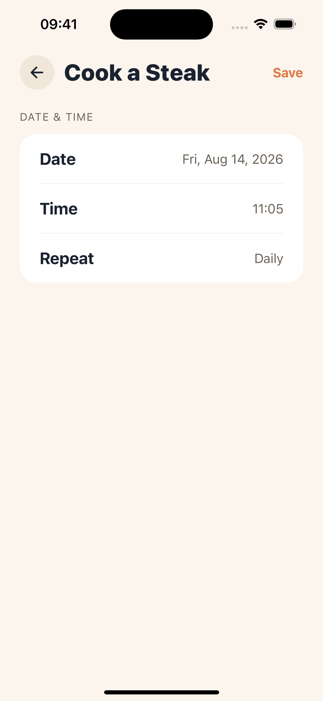 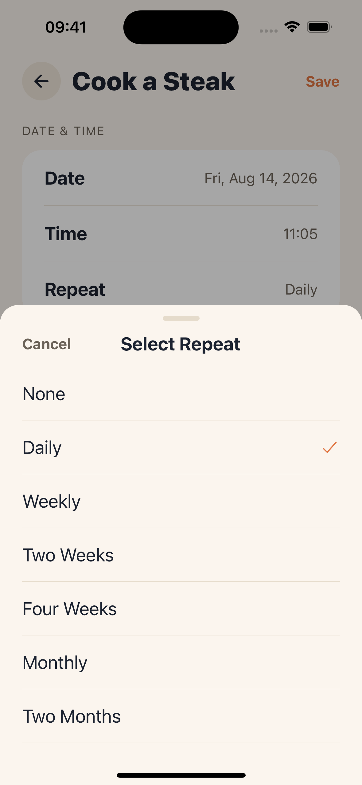

Starting an occurrence is deliberately gated behind a confirmation, because it
is the one transition the user cannot undo — a started occurrence can be skipped
but never deleted.

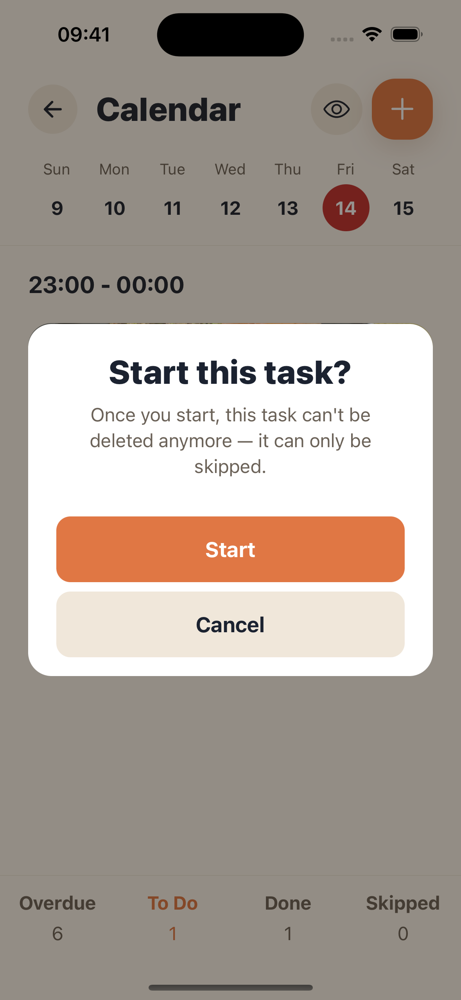

### Running a task

`TaskView` · `OccurrenceDetail` · `StepDetail`

Once started, the occurrence shows a running `n of N steps done` progress bar
over its own frozen copy of the steps. Opening a step drops into the player: the
photo fills the screen, the instruction sits in a high-contrast caption bar, and
three large controls sit underneath — **undo**, **read aloud** (text-to-speech),
and **next**.

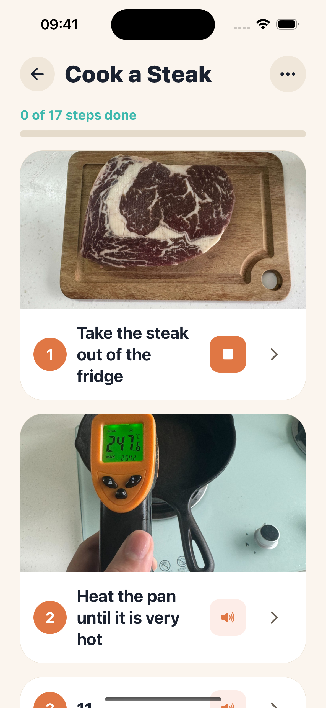 

When an occurrence starts, its steps are **snapshotted**. The occurrence then
renders that frozen copy rather than the live template — otherwise editing a
task mid-series could strand an in-progress occurrence that could never be
completed. See [`docs/step-snapshots.md`](docs/step-snapshots.md) for the design
notes and the trade-offs.

### Caregiver view

`CaregiverHome` · `PatientOverview` · `Reports` · `ReportPreview` · `ReportView`

Users with the `SUPPORT_PERSON` role land on their own home screen showing
linked patients, can drill into a patient's tasks and schedule on their behalf,
and can generate AI-written progress reports.

This portal was built by [@usaycurry](https://github.com/usaycurry); my work
here was limited to the role-driven root routing that keeps caregivers out of
the primary-user stack, and gating ungrounded AI-generated steps to caregivers.

### Settings & accessibility

`Settings` · `Interface` · `Notifications` · `AudioSpeech` · `PrivacyPolicy`

- **Simple Mode** — a reduced interface branched on across 6 screens plus the
  root-route resolver, for users who need fewer choices on screen
- **Text-to-speech** — a 0–100 speed slider mapped to a symmetric TTS rate in
  `[0.5, 1.5]`, so the default of 50 is exactly 1.0×
- **Reminders** — off by default, opt-in permission, choice of "at the scheduled
  time" or "15 minutes before"
- **Starting page** — choose which screen the app opens on

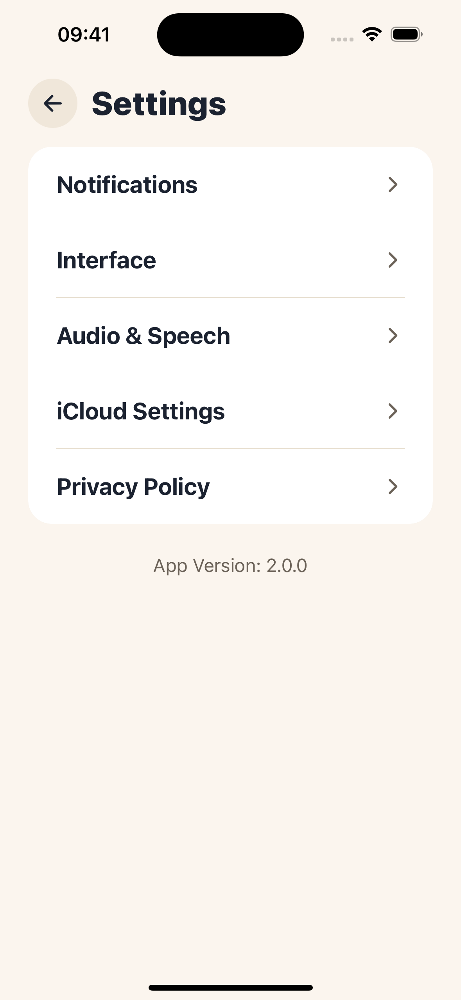 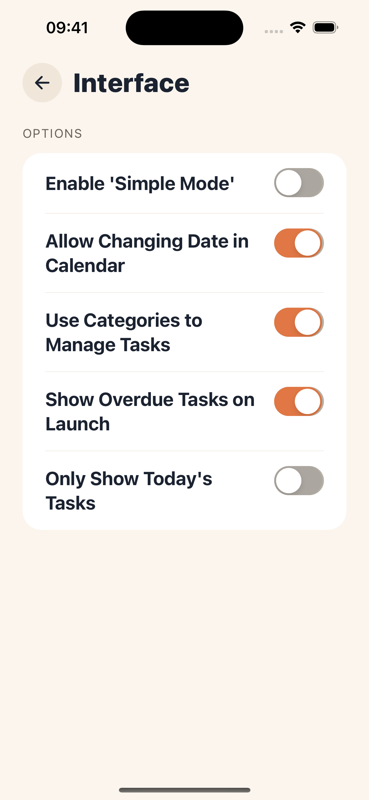 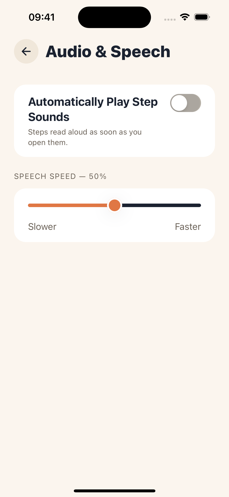 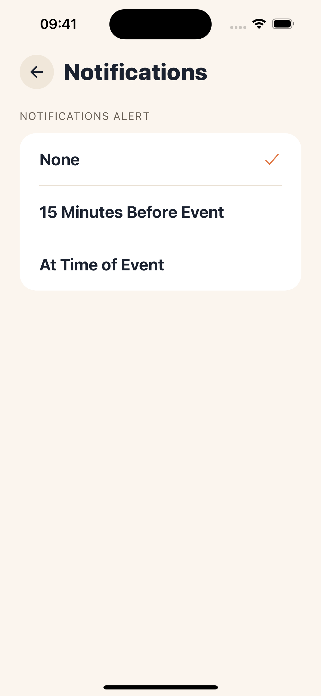

---

## Features

- 📅 **Calendar scheduling** — one-off and recurring (RRULE) assignments, day and
  month views, overdue history
- ✅ **Step-by-step execution** — swipeable player, per-step check-off, server-side
  timing, resumable progress
- 🖼 **Rich step media** — photo, video, audio and text per step, with an on-device
  thumbnail cache
- 🔊 **Text-to-speech** — read any step aloud at an adjustable rate
- 🔔 **Local reminders** — rolling 14-day notification window, tap-to-open the task
- 👥 **Caregiver portal** — linked patients, delegated scheduling, AI progress reports
- ♿ **Accessibility** — Simple Mode, high-contrast warm palette, large touch targets
- 💾 **Instant cold start** — the server-state cache is persisted to disk, so the app
  opens on real data instead of a spinner

---

## Tech stack

| Layer | Choice |
| --- | --- |
| Language | TypeScript 5.9 (`strict`, `noUnusedLocals`, `noUnusedParameters`) |
| Framework | React Native 0.81 · React 19 · **Expo SDK 54** (dev-client workflow) |
| Navigation | React Navigation 6 — native stack, 30 typed routes |
| Server state | TanStack Query 5 — infinite queries, mutations, disk-persisted cache |
| Auth | AWS Amplify 6 (Cognito User Pool) behind a pluggable token provider |
| API | Hand-written fetch-based **AWS AppSync GraphQL** client — 66 operations (42 mutations, 24 queries) |
| Local storage | AsyncStorage |
| Media | `expo-image`, `expo-video`, `expo-audio`, `expo-image-manipulator`, `expo-file-system` |
| Motion | Reanimated 4 · Gesture Handler · `react-native-draggable-flatlist` |
| Speech & alerts | `expo-speech`, `expo-notifications` |
| Testing | Jest 29 + `jest-expo` — 113 unit tests across 11 files |
| CI | GitHub Actions — `tsc --noEmit` + `jest` on every push and PR |

---

## Architecture

Data flows one way through clearly separated layers. **Screens never call the
network directly.**

```text
Screen  →  Feature hook (TanStack Query)  →  Feature API facade  →  Shared GraphQL client  →  AWS AppSync
```

```text
src/
├── app/                    AppProviders (QueryClient + PersistGate + Session), SessionContext
├── navigation/             Typed route params, root-route resolver, navigation ref
├── screens/                30 route screens + modals
├── features/
│   ├── assignments/        Occurrence lifecycle, step snapshots, completion reconciliation
│   ├── tasks/              Task templates, steps, drag-to-reorder cache surgery
│   ├── categories/         Category management
│   ├── notifications/      Rolling-window reminder scheduler + tap handling
│   ├── settings/           Interface / audio / alert preference stores
│   ├── media/              Thumbnail + preview caches
│   ├── auth/               Amplify config, Cognito token provider
│   ├── users/              Profiles, support links
│   ├── reports/            Caregiver progress reports
│   └── ai/                 Source-cited step generation
└── shared/
    ├── api/                graphqlClient, canplanApi, operations, types, errors
    ├── query/              queryClient defaults, query keys, disk persistence
    ├── components/         12 reusable components
    └── theme/              Design tokens
```

Each feature module owns an `api/` facade and a `hooks/` folder, plus pure logic
files that are unit-tested in isolation. A few patterns worth calling out:

- **Pluggable auth seam.** `shared/api/authTokenProvider.ts` is a runtime-injected
  provider; Amplify registers a Cognito ID-token getter into it at startup. The
  GraphQL client itself has no Amplify dependency.
- **Normalized errors.** `graphqlClient.ts` collapses four failure modes (HTTP 401,
  HTTP 200 with an `errors` array, malformed JSON, null data) into one
  `GraphQLRequestError`.
- **Cursor pagination.** List hooks are infinite queries that pass AppSync's opaque
  `nextToken` through unchanged.
- **Disk-persisted cache.** `shared/query/persist.ts` dehydrates the query cache to
  AsyncStorage behind a write throttle and a versioned key; a `PersistGate` holds
  the splash screen until restore completes.
- **Optimistic overrides.** Local override maps sit on top of cached server reads,
  roll back on a failed write, and retire once the server confirms.

---

## Data model

The backend is a separate repository; this app is a client against it.

| Entity | Notes |
| --- | --- |
| `UserProfile` | Role (`PRIMARY_USER` / `SUPPORT_PERSON`), accessibility settings (`AWSJSON`) |
| `SupportLink` | Links a caregiver to a primary user |
| `Category` | Groups task templates |
| `Task` | A reusable template owned by a user |
| `TaskStep` | Ordered step with text, description, and optional media |
| `Assignment` | A task scheduled onto a calendar — one-off, or recurring via RRULE |
| `TaskInstance` | A concrete occurrence of an assignment on a given date |
| `TaskInstanceStep` | Per-occurrence step completion + timing snapshot |
| `MediaAsset` | S3 object metadata, fetched through presigned URLs |

Templates and occurrences are deliberately separate: a `Task`'s status is its
template lifecycle, while what the user actually did lives on `TaskInstance` and
`TaskInstanceStep`.

---

## Getting started

Requires **Node.js 18+**.

```bash
npm install
cp .env.example .env.local
```

Set your backend endpoints in `.env.local`:

```bash
EXPO_PUBLIC_GRAPHQL_URL=https://YOUR-APP-ID.appsync-api.YOUR-REGION.amazonaws.com/graphql
EXPO_PUBLIC_COGNITO_USER_POOL_ID=YOUR-REGION_XXXXXXXXX
EXPO_PUBLIC_COGNITO_USER_POOL_CLIENT_ID=XXXXXXXXXXXXXXXXXXXXXXXXXX
```

Then:

```bash
npm start          # Expo dev server
npm run ios        # iOS Simulator (macOS)
npm run android    # Android emulator
```

| Script | Description |
| --- | --- |
| `npm start` | Start the Expo dev server |
| `npm run ios` / `npm run android` | Launch on a simulator/emulator |
| `npm run lint` | Type-check only (`tsc --noEmit`) |
| `npm test` | Run the Jest unit tests |

> Environment variables are read at build time — **restart the dev server after
> editing `.env.local`**.

This project uses the Expo **dev-client** workflow (not Expo Go), because
Amplify Auth and several media modules need native code. Build a dev client with
`npx expo run:ios` / `npx expo run:android` the first time.

**No secrets are committed.** The endpoint comes from `EXPO_PUBLIC_GRAPHQL_URL`,
the Cognito config from `EXPO_PUBLIC_COGNITO_*`, and the ID token from Amplify at
runtime. `.env*` files other than `.env.example` are git-ignored.

---

## Testing

```bash
npm test
```

**113 unit tests across 11 files**, covering the logic that is easy to get subtly
wrong and impossible to see from the outside:

| Module | What's tested |
| --- | --- |
| `buildDayRows` | Calendar day-list assembly — loading/error/empty precedence, hour grouping, overdue expansion rules |
| `occurrenceStatus` | Live OVERDUE derivation against the device clock |
| `stepCompletion` | Optimistic override merge + prune (undo must win locally) |
| `occurrenceSteps` | Step snapshot construction and template re-join |
| `reorderCachedStepPages` | Renumbering and redealing steps across cached page boundaries |
| `rootRoute` | Which stack the app boots into, given session + profile + settings |
| `patientAvatar` | Deterministic avatar tint and initials |

Component/render tests are intentionally out of scope — the pure reducers and
builders carry the branch-heavy logic, and they're where regressions actually
happened. See [`docs/calendar-testing.md`](docs/calendar-testing.md) for the
manual verification checklist.

CI runs `tsc --noEmit` and the Jest suite on every push and pull request
([`.github/workflows/ci.yml`](.github/workflows/ci.yml)).

---

## Project status & limitations

This is a **course capstone project**, not a shipped product. Being explicit
about what it is *not*:

- **No production deployment.** Version `0.1.0`; no App Store or Play Store
  release, no real users.
- **No offline write support.** The read cache is persisted to disk and the UI
  applies optimistic overrides, but there is **no write queue and no conflict
  resolution** — offline sync is future work, not a shipped feature.
- **Client only.** The AppSync schema, resolvers, authorization rules, S3
  presigning, and AI report generation live in a separate backend repository
  owned by the same team.
- **AI-assisted development.** Much of my work on this repo was written with AI
  pair-programming assistance; commits carry `Co-Authored-By` trailers where that
  applies.

### Roadmap

- Offline cache + write/sync queue (SRS `FR-OFF-01..04`)
- Real-time help requests and supporter messaging
- Bluetooth switch accessibility input, terminal-mode support
- Employment / Education / Seniors & Dementia onboarding modules
